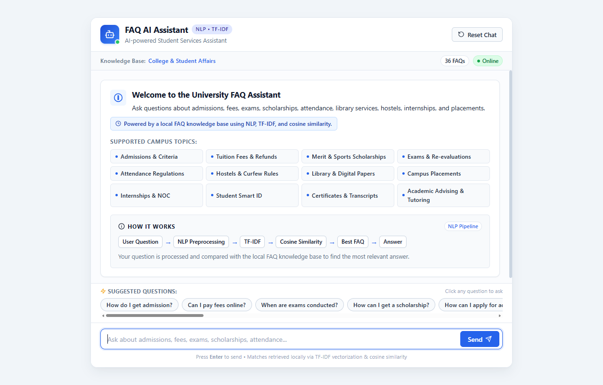
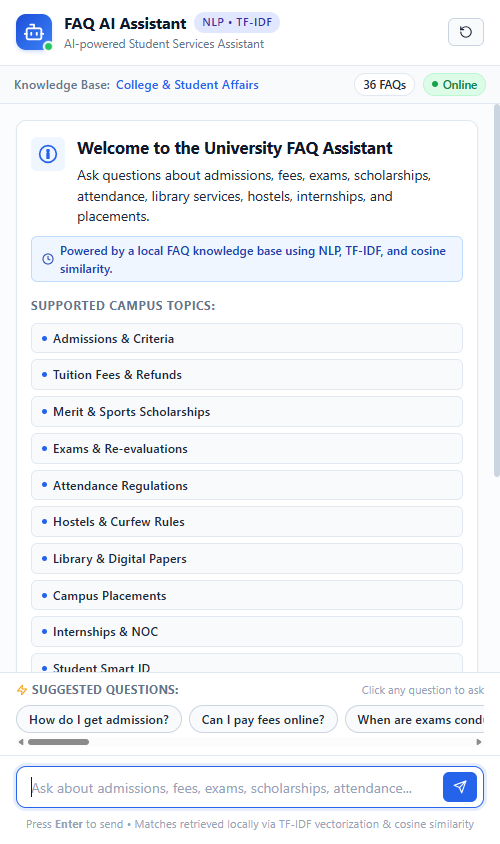

> **CodeAlpha AI Internship — Task 2**

# FAQ AI Assistant

A modern NLP-powered university FAQ chatbot built using classical Natural Language Processing, TF-IDF vectorization, and cosine similarity.

[](https://www.python.org/)
[](https://flask.palletsprojects.com/)
[](https://www.nltk.org/)
[](https://scikit-learn.org/)
[]()

---

> [!NOTE]
> **Fictional Demonstration Knowledge Base**: The FAQ dataset is a generalized, fictional demonstration knowledge base and does not represent the official policies of a real university. It was crafted strictly to evaluate tokenization, lemmatization, and vector similarity algorithms.

> [!IMPORTANT]
> **Classical Statistical NLP**: This application is powered strictly by classical Natural Language Processing (NLTK text preprocessing, WordNet lemmatization, Scikit-learn TF-IDF vectorization, and cosine similarity). It runs 100% locally with zero external API dependencies, cloud models, or proprietary generative LLMs.

---

## 📸 Project Preview

<!--
SCREENSHOT PLACEHOLDER:
To render the project preview, copy approved screenshot captures into docs/screenshots/:
- docs/screenshots/desktop.png
- docs/screenshots/mobile.png

Recommended layout:
### Desktop


### Responsive Mobile

-->

> [!NOTE]
> **Interface Preview**: Screenshots need to be copied into `docs/screenshots/` (`desktop.png` and `mobile.png`) before the preview section can render. Once added, the desktop and mobile interface previews will display here.

---

## Table of Contents

- [Project Overview](#project-overview)
- [Key Features](#-key-features)
- [Technology Stack](#technology-stack)
- [How It Works](#how-it-works)
  - [Processing Pipeline](#processing-pipeline)
  - [1. NLP Preprocessing](#1-nlp-preprocessing)
  - [2. Sublinear TF-IDF Vectorization](#2-sublinear-tf-idf-vectorization)
  - [3. Cosine Similarity Calculation](#3-cosine-similarity-calculation)
  - [4. FAQ Question Variants](#4-faq-question-variants)
  - [5. Ambiguity Handling & Candidate Margin](#5-ambiguity-handling--candidate-margin)
  - [6. Conversational Intent Handling](#6-conversational-intent-handling)
  - [7. Fallback & Low-Confidence Protection](#7-fallback--low-confidence-protection)
- [System Architecture](#system-architecture)
- [Project Structure](#project-structure)
- [Installation & Running](#installation--running)
- [Testing](#testing)
- [API Documentation](#api-documentation)
- [Example Questions & Behavior](#example-questions--behavior)
- [Limitations](#limitations)
- [Future Enhancements](#future-enhancements)
- [Internship Task](#-internship-task)

---

## Project Overview

In university environments and campus student service centers, administrative teams receive hundreds of repetitive queries regarding admission procedures, tuition fee deadlines, examination schedules, scholarship criteria, and hostel accommodations.

The application allows students to ask natural-language questions about common university services.

The chatbot:
* **Preprocesses** the query using NLTK (cleaning, tokenization, stopword removal, dual-phase lemmatization)
* **Represents** FAQ questions using TF-IDF feature vectors
* **Calculates** cosine similarity against indexed FAQ items
* **Selects** the most relevant FAQ based on mathematical vector alignment
* **Applies** ambiguity and domain safeguards to prevent false positives
* **Returns** a transparent similarity score for full explainability
* **Falls back** safely when a reliable answer cannot be identified

> **Knowledge Base Notice**: The FAQ dataset is a generalized, fictional demonstration knowledge base and does not represent the official policies of a real university.

---

## ✨ Key Features

* **Natural-Language FAQ Matching**: Matches varied student phrasings and colloquial queries to verified campus answers.
* **NLTK Preprocessing**: Robust pipeline featuring tokenization, punctuation removal, English stopword filtering, and dual-phase (verb & noun) WordNet lemmatization.
* **TF-IDF Vectorization**: Sublinear term frequency scaling and $(1, 2)$ n-gram modeling to capture key domain phrases.
* **Cosine Similarity Matching**: Length-invariant angular distance computation yielding normalized similarity scores.
* **193 Question Variants across 36 FAQs**: Comprehensive knowledge base spanning 15 distinct campus service categories.
* **15 FAQ Categories**: Admissions, Fees, Scholarships, Exams, Attendance, Hostel, Library, Placements, Internships, Student ID, Timetables, Certificates, Courses, Academic Support, and Contacts.
* **Ambiguity Detection**: Evaluates top candidate margins ($\Delta = 0.08$) to detect broad, underspecified questions and ask for clarification.
* **Domain-Specific Guardrails**: Prevents category overlap (e.g., general vs. sports scholarships, exam dates vs. re-evaluation).
* **Greeting and Gratitude Handling**: Polite regex-based conversational handlers for common pleasantries without triggering false FAQ lookups.
* **Safe Fallback Responses**: Deterministic fallback guidance when user queries fall outside indexed campus knowledge.
* **Responsive Web Interface**: Modern, accessible UI with quick-start suggested questions, clear similarity badges, and chat reset.
* **REST API Endpoints**: Standardized JSON endpoints for integration and automated evaluation.
* **Automated Test Suite with 28 Tests**: Thorough verification covering schema, preprocessing, matching, guardrails, and HTTP routes.

---

## Technology Stack

```
Backend:
* Python 3.10+
* Flask 3.x

NLP:
* NLTK (Tokenization, Stopwords, WordNet Lemmatizer)
* TF-IDF (Scikit-learn TfidfVectorizer)
* Scikit-learn (Pairwise Metrics)
* Cosine Similarity

Frontend:
* HTML5 (Semantic Structure)
* CSS3 (Modern Flexbox/Grid, Responsive Design)
* Vanilla JavaScript (ES6+, Fetch API, Dynamic DOM)

Testing:
* Python unittest
```

| Component | Technology | Purpose |
| :--- | :--- | :--- |
| **Backend Framework** | Python 3.10+ / Flask 3.x | Lightweight WSGI web framework and REST API server |
| **NLP Preprocessing** | NLTK (`nltk`) | Tokenization, English stopword removal, WordNet lemmatizer |
| **Feature Extraction** | Scikit-learn (`scikit-learn`) | `TfidfVectorizer` with sublinear TF scaling and $(1, 2)$ n-grams |
| **Similarity Metric** | Scikit-learn (`metrics.pairwise`) | `cosine_similarity` for normalized vector distance calculation |
| **Numerical Processing**| NumPy (`numpy`) | Array indexing and multi-candidate score comparisons |
| **Data Storage** | JSON (`data/faqs.json`) | Portable, decoupled FAQ knowledge base with question variants |
| **Frontend UI** | Semantic HTML5, CSS3, Vanilla JS | Zero-dependency, responsive interface with SVG icons |
| **Test Framework** | Python `unittest` | Automated unit, regression, and integration testing |

---

## How It Works

### Processing Pipeline

```text
User Question
      ↓
NLP Preprocessing
      ↓
TF-IDF Vectorization
      ↓
Cosine Similarity
      ↓
Candidate / Ambiguity Evaluation
      ↓
Best FAQ or Clarification
      ↓
   Response
```

---

### Detailed Technical Explanation

#### 1. NLP Preprocessing
Raw input strings undergo a 4-stage sequential transformation in [`chatbot/preprocessing.py`](chatbot/preprocessing.py):
1. **Text Cleaning**: Replaces punctuation and special characters with spaces, converts characters to lowercase, and strips extra whitespace.
2. **Tokenization**: Uses `nltk.tokenize.word_tokenize` to isolate individual tokens.
3. **Stopword Removal**: Eliminates uninformative English function words (e.g., *"the"*, *"is"*, *"in"*, *"at"*, *"of"*, *"for"*).
4. **Dual-Phase Lemmatization**: Utilizes `nltk.stem.WordNetLemmatizer` to reduce tokens to dictionary root forms, first attempting verb lemmatization (`pos='v'`) followed by noun lemmatization (`pos='n'`).
   *Examples: `"applying"` $\rightarrow$ `"apply"`, `"fees"` $\rightarrow$ `"fee"`, `"registered"` $\rightarrow$ `"register"`, `"scholarships"` $\rightarrow$ `"scholarship"`.*

#### 2. Sublinear TF-IDF Vectorization
The processed tokens are converted into numerical feature vectors using `TfidfVectorizer`:
$$\text{TF-IDF}(t, d, D) = \text{TF}(t, d) \times \text{IDF}(t, D)$$

- **Sublinear Term Frequency**: Replaces raw count $\text{TF}$ with $1 + \ln(\text{TF})$ to prevent frequent words from dominating similarity scores.
- **Inverse Document Frequency**: Penalizes terms that appear ubiquitously across many FAQ entries:
  $$\text{IDF}(t) = \ln\left(\frac{1 + N}{1 + \text{DF}(t)}\right) + 1$$
- **N-gram Modeling**: Analyzes both unigrams and bigrams $(1, 2)$ so that contextual phrases (such as `"pay fee"`, `"hostel fee"`, or `"id card"`) carry distinct feature weights.

#### 3. Cosine Similarity Calculation
The query vector $\vec{u}$ is compared against all indexed FAQ entry vectors $\vec{v}_i$:
$$\text{Similarity}(\vec{u}, \vec{v}_i) = \cos(\theta) = \frac{\vec{u} \cdot \vec{v}_i}{\|\vec{u}\| \|\vec{v}_i\|} = \frac{\sum_{k} u_k v_{ik}}{\sqrt{\sum_{k} u_k^2} \sqrt{\sum_{k} v_{ik}^2}}$$

The metric outputs a normalized scalar value between $0.0$ (no overlap) and $1.0$ (identical vector orientation). Because cosine similarity measures the angle rather than vector magnitude, it remains invariant to document length.

> [!NOTE]
> **Similarity Score vs. Confidence**: Cosine similarity measures vector orientation proximity in TF-IDF feature space, producing a transparent similarity score between $0.0$ and $1.0$. It is an explainable geometric metric, not a probabilistic confidence percentage or factuality score.

#### 4. FAQ Question Variants
To bridge vocabulary variations without retraining, each FAQ entry in [`data/faqs.json`](data/faqs.json) contains multiple natural-language question variants:
```json
{
  "id": 1,
  "question": "How can I apply for admission to the university?",
  "variants": [
    "How do I get admission?",
    "How can I apply for admission?",
    "What is the admission process?",
    "How do I enroll in the university?",
    "Where can I submit my admission application?"
  ],
  "answer": "You can apply online through the university admissions portal...",
  "category": "Admissions"
}
```
During initialization, the vectorizer builds its vocabulary across all **193 variants**. When any variant matches, the system retrieves the canonical FAQ answer and displays the canonical question in the UI.

#### 5. Ambiguity Handling & Candidate Margin
To prevent false-positive answers on broad queries, [`chatbot/matcher.py`](chatbot/matcher.py) inspects the top two ranked candidates:
- If the difference between the top score $s_1$ and second score $s_2$ is less than the ambiguity margin ($\Delta = s_1 - s_2 < 0.08$), the query is recognized as potentially ambiguous.
- **Domain Guardrails**:
  - *"How can I get a scholarship?"* matches the general **Merit Scholarship** FAQ rather than the specific Sports Scholarship unless athletic/sports keywords are explicitly mentioned.
  - *"What about fees?"* is recognized as broad and triggers a polite clarification prompt rather than assuming an online payment intent.
  - *"When are exams conducted?"* matches the **Exam Schedule** FAQ and refuses to match Re-evaluation unless rechecking terms are present.

#### 6. Conversational Intent Handling
Before vector search, the engine checks for conversational pleasantries using regex patterns:
- **Greetings**: `"hello"`, `"hi"`, `"hey"`, `"good morning"`, `"good afternoon"`, `"good evening"` $\rightarrow$ Returns a warm welcome introducing available student service topics.
- **Gratitude**: `"thank you"`, `"thanks"`, `"thank you so much"` $\rightarrow$ Returns a polite acknowledgement.

#### 7. Fallback & Low-Confidence Protection
If the best cosine similarity score falls below the configured threshold (default `0.25`), the chatbot enters its low-confidence fallback decision state and returns a helpful fallback response:
```json
{
  "answer": "I'm sorry, I couldn't find a reliable answer to that question in my knowledge base. Try asking about admissions, courses, fees, scholarships, exams, attendance, library, hostels, internships, or campus placements.",
  "category": "Fallback",
  "confidence": 0.0,
  "confidence_pct": 0.0,
  "is_fallback": true,
  "matched_question": null
}
```

---

## System Architecture

```text
                               +-----------------------------+
                               |        User Browser         |
                               | (HTML5 / CSS3 / Vanilla JS) |
                               +-----------------------------+
                                              |
                          JSON Request: POST /api/chat {"message": "..."}
                                              v
                               +-----------------------------+
                               |      Flask Application      |
                               |          (app.py)           |
                               +-----------------------------+
                                              |
                                              v
                               +-----------------------------+
                               |  NLP Preprocessing Pipeline |
                               |    (preprocessing.py)       |
                               | - Lowercase & Clean Text    |
                               | - Tokenization (NLTK)       |
                               | - Stopwords Filtering       |
                               | - WordNet Lemmatization     |
                               +-----------------------------+
                                              |
                                              v
                               +-----------------------------+
                               |     TF-IDF Vectorizer       |
                               |        (matcher.py)         |
                               | - 1-gram & 2-gram Features  |
                               | - Pre-fitted on 193 Variants|
                               +-----------------------------+
                                              |
                                              v
                               +-----------------------------+
                               |  Cosine Similarity Engine   |
                               | - Inner Product with Matrix |
                               | - Sort Candidate Scores     |
                               +-----------------------------+
                                              |
                                              v
                               +-----------------------------+
                               | Ambiguity & Threshold Check |
                               | - Threshold Check (>= 0.25) |
                               | - Margin Check (s1 - s2)    |
                               | - Domain Keyword Guardrails |
                               +-----------------------------+
                                              |
                       +----------------------+----------------------+
                       |                                             |
                 [Match Found]                               [No Match / Ambiguous]
                       v                                             v
        +-----------------------------+               +-----------------------------+
        |  Return Canonical Answer    |               |   Return Clarification or   |
        |  Category & Similarity %    |               |   Domain Fallback Message   |
        +-----------------------------+               +-----------------------------+
```

---

## Project Structure

```text
CodeAlpha_FAQ_Chatbot/
├── app.py                      # Flask web application & REST API routes
├── requirements.txt            # Minimal runtime dependencies
├── README.md                   # Technical documentation & project guide
├── .gitignore                  # Git rules excluding venv, cache, OS files, logs
│
├── data/
│   └── faqs.json               # 36 canonical FAQs with 193 question variants
│
├── chatbot/
│   ├── __init__.py             # Chatbot package initialization
│   ├── preprocessing.py        # Text cleaning, NLTK tokenization, stopwords, lemmatization
│   └── matcher.py              # TF-IDF vectorizer, cosine similarity, ambiguity engine
│
├── templates/
│   └── index.html              # Modern, accessible semantic HTML5 chat interface
│
├── static/
│   ├── css/
│   │   └── style.css           # Responsive styles, typography, badges, pipeline diagram
│   └── js/
│       └── script.js           # Interactive UI, AJAX communication, suggestion chips
│
├── docs/
│   └── screenshots/            # Project UI screenshots directory
│       └── .gitkeep            # Directory tracking
│
└── test_chatbot.py             # Complete automated test suite (28 unit tests)
```

---

## Installation & Running

### Quickstart

Clone the repository and launch the application in a few commands:

```bash
git clone https://github.com/nathin1ga24ci074-KAISER/CodeAlpha_FAQ_Chatbot.git
cd CodeAlpha_FAQ_Chatbot

# 1. Create virtual environment
python -m venv venv

# 2. Activate virtual environment
# Windows:
venv\Scripts\activate
# macOS/Linux:
# source venv/bin/activate

# 3. Install dependencies
pip install -r requirements.txt

# 4. Run the application
python app.py
```

Then open your browser and navigate to:
👉 **`http://127.0.0.1:5000`**

> [!NOTE]
> The application is 100% self-contained and local. It does **not** require any third-party API keys or external services.

### Manual NLTK Corpora Download (Optional)

NLTK packages (`punkt`, `punkt_tab`, `stopwords`, `wordnet`) download automatically on first run. To pre-download them manually:

```powershell
python -c "import nltk; nltk.download('punkt'); nltk.download('punkt_tab'); nltk.download('stopwords'); nltk.download('wordnet')"
```

---

## Testing

The project includes an automated test suite executed with Python's standard `unittest` framework:

```bash
python test_chatbot.py
```
or:
```bash
python -m unittest discover
```

### Test Results

**28 automated tests passed.**

```text
............................
----------------------------------------------------------------------
Ran 28 tests in 0.116s

OK
```

### Test Suite Coverage
The 28 tests validate:
* **Preprocessing**: Lowercasing, punctuation stripping, tokenization, stopword removal, and verb/noun lemmatization
* **FAQ Schema**: JSON structure integrity, required fields, unique IDs, non-empty questions and answers, and valid category assignment
* **Exact Matching**: Canonical questions correctly retrieve corresponding answers with high similarity scores
* **Paraphrased Variants**: Alternative phrasings, word orders, and synonyms correctly map to target FAQs
* **Ambiguity Handling**: Detection of ambiguous queries with narrow score margins ($\Delta < 0.08$) and appropriate clarification prompts
* **Category Guardrails**: Keyword-guided disambiguation (merit vs. sports scholarships, exam dates vs. re-evaluations)
* **Greetings**: Conversational pleasantries handled politely without triggering accidental FAQ lookups
* **Gratitude**: Thanks and appreciation phrases recognized and acknowledged
* **Fallback**: Out-of-domain queries, gibberish strings, empty inputs, and whitespace safely route to fallback
* **Flask Endpoints**: HTTP status codes, headers, and JSON schemas for `GET /`, `GET /api/health`, `POST /api/chat`, `GET /api/sample-questions`, and `GET /api/categories`

---

## API Documentation

### Summary of Endpoints

| Method | Endpoint | Description |
| :--- | :--- | :--- |
| `GET` | `/` | Renders the student chat web interface |
| `GET` | `/api/health` | Returns server health status and knowledge base statistics |
| `POST` | `/api/chat` | Receives user queries, runs NLP matching, and returns answers |
| `GET` | `/api/sample-questions`| Returns curated quick-start sample questions |
| `GET` | `/api/categories` | Returns the list of 15 indexed knowledge base categories |

---

### Detailed Endpoint Specifications

#### 1. `GET /api/health`
Checks application health and reports indexed knowledge base statistics.

**Response `(200 OK)`**:
```json
{
  "ambiguity_margin": 0.08,
  "categories_count": 15,
  "faq_count": 36,
  "status": "healthy",
  "threshold": 0.25,
  "variants_count": 193
}
```

---

#### 2. `POST /api/chat`
Submits a natural language query for NLP preprocessing and similarity matching.

**Request Header**:
`Content-Type: application/json`

**Request Body**:
```json
{
  "message": "How do I get admission?"
}
```

**Success Response `(200 OK — Direct FAQ Match)`**:
```json
{
  "answer": "You can apply online through the university admissions portal. Complete the registration form, upload the required academic transcripts and identity documents, and pay the non-refundable application fee.",
  "category": "Admissions",
  "confidence": 1.0,
  "confidence_pct": 100.0,
  "is_fallback": false,
  "matched_question": "How can I apply for admission to the university?"
}
```

**Clarification Response `(200 OK — Ambiguous Query)`**:
```json
{
  "answer": "Your question about fees is broad or ambiguous. Could you be more specific? You can ask about online tuition fee payment methods, refund policies, exam fees, or hostel fees.",
  "category": "Fallback",
  "confidence": 0.308,
  "confidence_pct": 30.8,
  "is_fallback": true,
  "matched_question": null
}
```

**Fallback Response `(200 OK — Out of Domain)`**:
```json
{
  "answer": "I'm sorry, I couldn't find a reliable answer to that question in my knowledge base. Try asking about admissions, courses, fees, scholarships, exams, attendance, library, hostels, internships, or campus placements.",
  "category": "Fallback",
  "confidence": 0.0,
  "confidence_pct": 0.0,
  "is_fallback": true,
  "matched_question": null
}
```

**Error Response `(400 Bad Request)`**:
```json
{
  "error": "The 'message' field cannot be empty or only whitespace."
}
```

---

#### 3. `GET /api/sample-questions`
Returns curated sample questions across distinct categories for quick-start suggestion chips.

**Response `(200 OK)`**:
```json
[
  { "category": "Admissions", "question": "How can I apply for admission to the university?" },
  { "category": "Fees", "question": "How can I pay my tuition fees online?" },
  { "category": "Exams", "question": "When will the semester examination schedule be announced?" }
]
```

---

#### 4. `GET /api/categories`
Returns all 15 indexed knowledge base topic categories.

**Response `(200 OK)`**:
```json
{
  "categories": [
    "Academic Support", "Admissions", "Attendance", "Certificates", "Contacts",
    "Courses", "Exams", "Fees", "Hostel", "Internships",
    "Library", "Placements", "Scholarships", "Student ID", "Timetables"
  ]
}
```

---

## Example Questions & Behavior

| Query | Category | Similarity Score | System Behavior |
| :--- | :--- | :--- | :--- |
| `"How can I apply for admission?"` | Admissions | 100.0% | Matches canonical admission FAQ via indexed variant |
| `"Can I pay fees online?"` | Fees | 100.0% | Matches online fee payment FAQ |
| `"How can I get a scholarship?"` | Scholarships | 100.0% | Matches general merit scholarship (not sports scholarship) |
| `"Are there sports scholarships?"` | Scholarships | 100.0% | Matches sports/extracurricular scholarship via intent guardrail |
| `"When are exams conducted?"` | Exams | 100.0% | Matches exam schedule FAQ (not re-evaluation FAQ) |
| `"What about fees?"` | Fallback | 30.8% | Triggers clarification request due to ambiguity margin check |
| `"I lost my student ID."` | Student ID | 100.0% | Matches replacement student ID card procedure |
| `"Hi there!"` | Greeting | 100.0% | Returns conversational welcome message |
| `"Thank you very much"` | Gratitude | 100.0% | Returns polite acknowledgement |
| `"What is quantum string theory?"`| Fallback | 0.0% | Safely falls back; prompts with supported campus topics |

---

## Limitations

1. **Lexical / Statistical Representation**: TF-IDF relies on n-gram word overlaps and morphological stems. It is a lexical and statistical technique that may struggle with extreme colloquial slang, typos, or highly indirect, figurative phrasing without explicit vocabulary overlap.
2. **Multi-Intent Queries**: When a student packs multiple disparate questions into a single input (e.g., *"What is the hostel fee and how do I apply for scholarships?"*), the vectorizer returns the single candidate with the highest aggregate similarity rather than answering both components separately.
3. **Demonstration Dataset**: The FAQ knowledge base is a synthetic demonstration dataset created for educational and evaluation purposes, rather than a live, official university policy repository.
4. **Stateless Single-Turn Interaction**: The engine evaluates each query independently and does not maintain multi-turn dialogue context (e.g., resolving follow-up questions such as *"When is the deadline for that?"*).

---

## Future Enhancements

1. **Semantic Embeddings**: Integrate dense neural representations (such as `sentence-transformers/all-MiniLM-L6-v2`) in a hybrid lexical-semantic pipeline to improve semantic recall on indirect phrasings.
2. **Larger Real-World Datasets**: Expand the knowledge base with real-world university regulations, dynamic fee schedules, and localized campus directory information.
3. **Multilingual Support**: Extend preprocessing and tokenization pipelines to support regional and international languages.
4. **Conversation Analytics**: Implement logging dashboards to detect unanswered student queries and continuously refine question variants.
5. **Production Deployment**: Containerize with Docker and deploy using production WSGI servers (e.g., Gunicorn or Waitress behind Nginx).

---

## 📌 Internship Task

- **Organization:** CodeAlpha
- **Task:** Task 2 — FAQ Chatbot
- **Approach:** Classical NLP using NLTK, TF-IDF, and cosine similarity
- **Author:** Nathin Gowda K G
- **Repository:** [CodeAlpha_FAQ_Chatbot](https://github.com/nathin1ga24ci074-KAISER/CodeAlpha_FAQ_Chatbot)
- **License:** Open-source educational project for portfolio and demonstration purposes.
